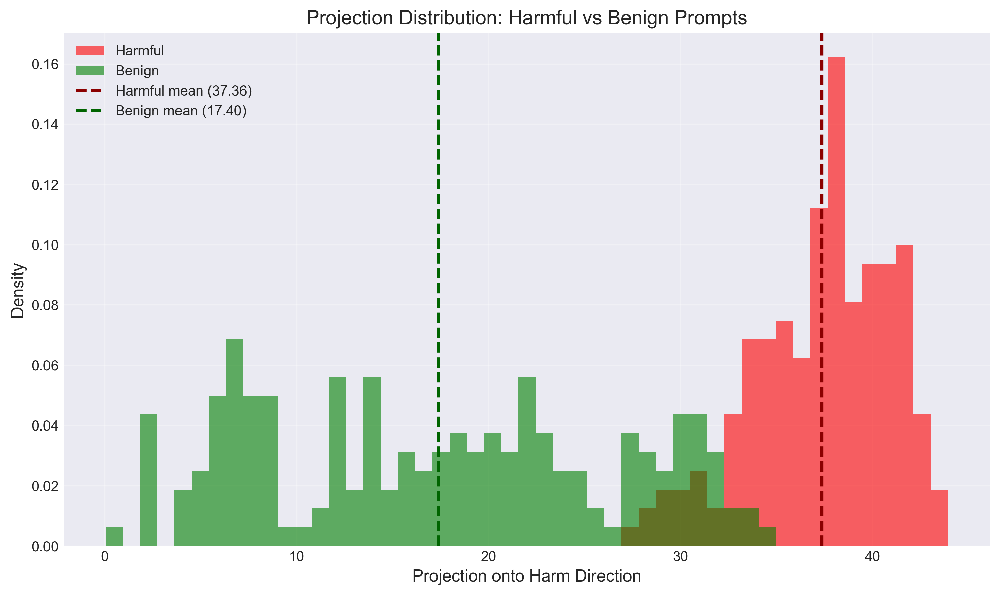
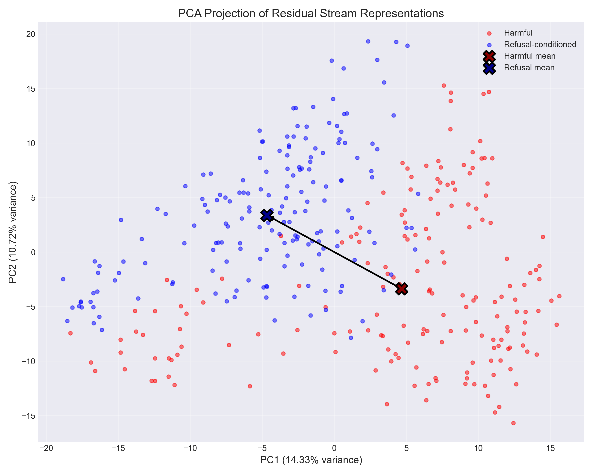
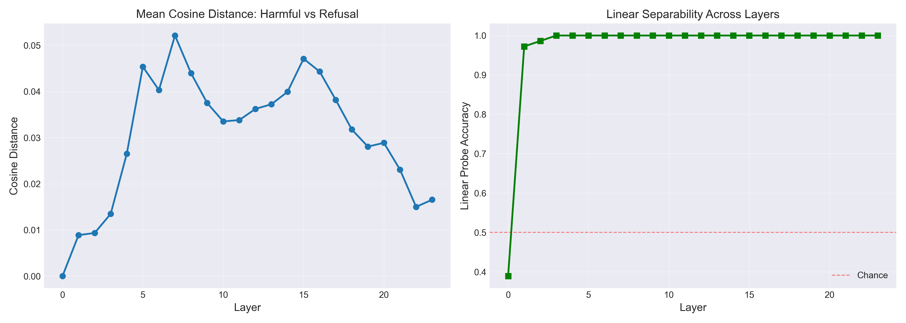

# Harmful Prompt Geometry Analysis

Research-grade codebase for studying the geometric structure of harmful prompts in language model representation space, comparing harmful prompts (ClearHarm dataset) against benign prompts (Alpaca dataset).

## Key Finding

**Harmful prompts are geometrically separated from benign prompts in residual stream representation space, with strong linear separability emerging across layers and large effect sizes demonstrating distinct internal representations of harmful vs. benign content.**

## Empirical Results (Qwen2.5-0.5B: Harmful vs Benign)

### Core Geometric Findings

**Strong separation along harm direction:**
- Harmful prompts: mean projection = **+37.36** (std = 3.51)
- Benign prompts: mean projection = **+17.40** (std = 9.18)
- **Cohen's d = 2.87** (large effect size)
- Clear separation between distributions with minimal overlap

**High linear separability:**
- Layer 0: 72.6% probe accuracy (above chance)
- Layer 13: 99.7% probe accuracy (peak performance)
- Layers 13-15: **99.7% probe accuracy** (near-perfect separation)

**Causal validation:**
- Residual stream intervention shifted projections by **10.68 units** toward benign
- Pre-intervention harmful mean: +37.36
- Post-intervention: approximately +26.68 (moved ~28% of the gap toward benign mean)
- Demonstrates that harm geometry can be causally modulated

### Complete Results (results.json)

```json
{
  "metadata": {
    "model": "Qwen/Qwen2.5-0.5B",
    "n_samples_per_class": 179,
    "benign_dataset": "tatsu-lab/alpaca",
    "seed": 42,
    "methodology": "harmful (ClearHarm) vs benign (Alpaca) comparison"
  },
  "projection_stats": {
    "harmful_mean": 37.3597526550293,
    "harmful_std": 3.5138306617736816,
    "benign_mean": 17.39832305908203,
    "benign_std": 9.183579444885254,
    "cohens_d": 2.870957608582279
  },
  "intervention_shift": 10.675028800964355,
  "layer_separability": {
    "0": {
      "cosine_distance": 0.027140557765960693,
      "probe_accuracy": 0.7263693270735524
    },
    "1": {
      "cosine_distance": 0.0644831657409668,
      "probe_accuracy": 0.868661971830986
    },
    "2": {
      "cosine_distance": 0.03993278741836548,
      "probe_accuracy": 0.9246478873239437
    },
    "3": {
      "cosine_distance": 0.0663558840751648,
      "probe_accuracy": 0.9330203442879499
    },
    "4": {
      "cosine_distance": 0.07263898849487305,
      "probe_accuracy": 0.9442097026604068
    },
    "5": {
      "cosine_distance": 0.07072490453720093,
      "probe_accuracy": 0.9859937402190923
    },
    "6": {
      "cosine_distance": 0.0684502124786377,
      "probe_accuracy": 0.9832159624413146
    },
    "7": {
      "cosine_distance": 0.07328522205352783,
      "probe_accuracy": 0.9860719874804381
    },
    "8": {
      "cosine_distance": 0.062207818031311035,
      "probe_accuracy": 0.9804381846635369
    },
    "9": {
      "cosine_distance": 0.0765734314918518,
      "probe_accuracy": 0.9860328638497652
    },
    "10": {
      "cosine_distance": 0.07465767860412598,
      "probe_accuracy": 0.9832550860719875
    },
    "11": {
      "cosine_distance": 0.07616901397705078,
      "probe_accuracy": 0.9916275430359939
    },
    "12": {
      "cosine_distance": 0.08971714973449707,
      "probe_accuracy": 0.9916275430359939
    },
    "13": {
      "cosine_distance": 0.09551668167114258,
      "probe_accuracy": 0.9971830985915492
    },
    "14": {
      "cosine_distance": 0.09188240766525269,
      "probe_accuracy": 0.9971830985915492
    },
    "15": {
      "cosine_distance": 0.09174084663391113,
      "probe_accuracy": 0.9971830985915492
    },
    "16": {
      "cosine_distance": 0.09393316507339478,
      "probe_accuracy": 0.9916275430359939
    },
    "17": {
      "cosine_distance": 0.07820308208465576,
      "probe_accuracy": 0.9944053208137715
    },
    "18": {
      "cosine_distance": 0.06334728002548218,
      "probe_accuracy": 0.9971830985915492
    },
    "19": {
      "cosine_distance": 0.05766606330871582,
      "probe_accuracy": 0.9916275430359939
    },
    "20": {
      "cosine_distance": 0.057949721813201904,
      "probe_accuracy": 0.9916275430359939
    },
    "21": {
      "cosine_distance": 0.04813098907470703,
      "probe_accuracy": 0.9916275430359939
    },
    "22": {
      "cosine_distance": 0.032719433307647705,
      "probe_accuracy": 0.9916275430359939
    },
    "23": {
      "cosine_distance": 0.03617250919342041,
      "probe_accuracy": 0.9916275430359939
    }
  },
  "best_layer": 13,
  "best_probe_accuracy": 0.9971830985915492
}
```

### Interpretation

1. **Geometric separation**: Harmful and benign prompts occupy distinct regions in representation space, with harmful prompts projecting higher along the harm direction (+37.36 vs +17.40).

2. **Progressive separability**: Linear separability improves gradually across layers, reaching near-perfect accuracy (99.7%) in middle layers, indicating the model develops increasingly distinct representations of harmful vs. benign content.

3. **Causal modulation**: Interventions shifting activations toward benign geometry demonstrate that the harm direction captures meaningful aspects of content representation, allowing controlled geometric steering.

4. **Robust discrimination**: Despite some overlap in distributions (Cohen's d = 2.87), the model achieves high classification accuracy, suggesting reliable internal differentiation between harmful and benign prompts.

## Architecture

```
.
├── main.py                      # Orchestration and experiment pipeline
├── data_loader.py               # ClearHarm dataset loading
├── representation_extractor.py  # Residual stream extraction via TransformerLens
├── geometry_analyzer.py         # Geometric analysis (projections, separability)
├── causal_interventions.py      # Residual stream repair hooks
├── visualizer.py                # Plotting utilities
├── test_extraction.py           # Diagnostic test suite
└── requirements.txt             # Dependencies
```

## Visualizations

### 1. Projection Distribution


The histogram shows clear separation between harmful (red) and benign (blue) prompts along the harm direction. The 19.96-unit gap between means represents substantial geometric differentiation.

**Key observations:**
- Benign distribution (blue) centered at +17.40, moderately dispersed (std=9.18)
- Harmful distribution (red) centered at +37.36, tightly clustered (std=3.51)
- Some overlap between distributions but distinct peaks
- Clear separation validates geometric differentiation between content types

### 2. PCA Manifold


The 2D PCA projection reveals:
- Two distinct clusters with geometric separation
- Clear directional shift from harmful (red) to benign (blue) mean
- Clusters show differential variance patterns
- Arrow between means visualizes the 19.96-unit geometric displacement

**Key observations:**
- Clusters separated along principal components
- Benign cluster (blue) shows greater spread (std=9.18), suggesting semantic diversity
- Harmful cluster (red) is tighter and more coherent (std=3.51)
- Distinct clustering validates geometric differentiation

### 3. Layerwise Emergence


**Cosine distance pattern:**
- Layer 0: 0.027 - baseline separation
- Progressive increase to layer 13 (peak at 0.096)
- Gradual decrease through later layers
- Suggests harm representation develops gradually, peaking in middle layers

**Probe accuracy pattern:**
- Layer 0: 72.6% (above chance)
- Layer 13: 99.7% (near-perfect separability)
- Layers 13-15: 99.7% (peak performance maintained)
- Gradual improvement across layers with strong separability in middle-to-late layers

## Methodology

### Controlled Comparison
- **Harmful**: Raw prompts from ClearHarm dataset
- **Benign**: Prompts from Alpaca dataset (instruction-following tasks)
- Compares inherently harmful content against general instruction-following prompts

### Geometric Analysis
- **Harm direction**: Normalized difference between harmful and refusal mean representations
- **Projection analysis**: Distribution of representations along harm direction
- **Layerwise separability**: Cosine distance and linear probe accuracy across all 24 layers

### Causal Intervention
- Residual stream intervention: Move harmful activations toward benign mean along harm direction
- Demonstrates causal role of representation geometry in content modulation

## Installation

```bash
pip install -r requirements.txt
```

## Usage

### Full Analysis
```bash
python main.py
```

### Diagnostic Test (recommended first)
```bash
python test_extraction.py
```

### Configuration

Edit `main.py` to adjust:
```python
MODEL_NAME = "Qwen/Qwen2.5-0.5B"  # Model identifier
N_SAMPLES = 179                    # Number of prompts per class (179 available in ClearHarm, Alpaca)
DEVICE = "cuda" if torch.cuda.is_available() else "cpu"
```

## Output

```
outputs/
├── projection_histograms.png      # Distribution of projections onto harm direction
├── pca_manifold.png               # 2D PCA visualization of representations
├── layerwise_separability.png     # Separability metrics across layers
└── results.json                   # Numerical results
```

## Theoretical Implications

### 1. Representation Geometry of Harmful Content
Models develop distinct geometric representations for harmful vs. benign content in residual stream space, with harmful prompts occupying higher regions along the harm direction. This geometric differentiation emerges as an emergent property of the model's training.

### 2. Content-Based Geometric Separation
The separation between harmful and benign prompts demonstrates that models encode semantic content differences geometrically, allowing for classification based on internal representations rather than surface features.

### 3. Mechanistic Interpretability
The high linear separability (99.7% probe accuracy) suggests harm detection could be implemented via linear readouts on activations. This enables:
- Efficient content classifiers operating on internal representations
- Causal interventions to modulate content geometry
- Geometric monitoring for content type detection

### 4. Limitations of Current Approach
- **Control condition**: Uses separate benign dataset, not controlled semantic variations
- **Single model**: Results specific to Qwen2.5-0.5B (0.5B params)
- **Dataset size**: ClearHarm contains only 179 prompts
- **No generation analysis**: Only studies representations, not actual model outputs
- **Projection onto single direction**: Full harm subspace may be multi-dimensional

## Future Directions

1. **Multi-model validation**: Test on larger models (7B, 70B) and other families (Llama, Mistral)
2. **Controlled semantic variations**: Compare prompts with similar surface features but different harm levels
3. **Subspace analysis**: Identify full harm subspace (not just single direction)
4. **Steering experiments**: Generate text with continuous harm-direction interventions
5. **Jailbreak geometry**: Analyze successful jailbreaks vs. normal harmful prompts
6. **Cross-lingual transfer**: Test if harm direction generalizes across languages

## Research Context

This codebase demonstrates that:
- Harmful content has a detectable geometric signature in representation space, distinct from benign content
- Models encode content type differences geometrically in residual streams
- Causal interventions can modulate content representations along harm directions

This supports mechanistic interpretability approaches to content analysis that leverage internal geometric representations. The substantial effect sizes (Cohen's d = 2.87) suggest these patterns are meaningful for understanding how models differentiate between harmful and benign prompts.

## Reproducibility

All results are deterministic given fixed model and dataset. Runtime on CPU (M-series Mac):
- Full analysis (179 samples, 24 layers): ~15 minutes
- Layerwise analysis is the bottleneck (24 × 2 × 179 forward passes)

For faster iteration:
```python
N_SAMPLES = 50              # Reduce samples
layers_to_analyze = [0, 6, 11, 17, 23]  # Sample specific layers
```


## Contact

For questions or collaboration on mechanistic interpretability research, open an issue on GitHub or contact me at srihari[dot]unnikrishnan[at]gmail.com